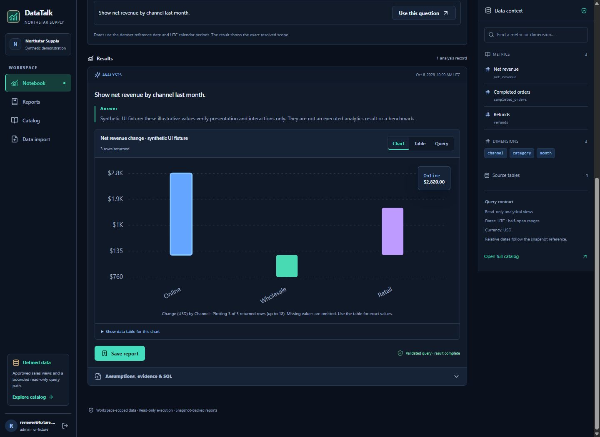

# DataTalk

> A governed analytics notebook with inspectable SQL and reports.



[Getting started](#getting-started) · [Architecture](docs/ARCHITECTURE.md) · [Evaluation](docs/EVALUATION.md) · [Security](docs/SECURITY.md)

## Overview

DataTalk is an analytical notebook for the fictional Northstar Supply sales dataset. A manager asks a question, checks the metric definitions and bounded SQL behind the answer, then saves and exports a versioned report. This repository is an independent portfolio project. All bundled customer and transaction data are synthetic.

### Core workflow

**Question → metric definition → bounded query → evidence → versioned report**

### Capabilities

- Metric catalog and scoped analytical queries
- Visible SQL and result evidence
- Saved reports with comparison and export

### Technology

FastAPI · React · LangGraph · PostgreSQL

### Evidence and scope

| Evidence | Observed result | Scope |
| --- | --- | --- |
| Answerable questions | 63/63 correct | Held-out synthetic DEMO API, deterministic planner and executed SQL |
| Clarification / denial | 15/15 appropriate; 22/22 security denials | Same 100-case run |
| End-to-end latency | p50 1,101.71 ms; p95 2,173.73 ms (`n=100`) | Local per-request timings; requests were sent sequentially with a 500 ms pause between them |
| Connected-model quality | Not measured | Requires configured provider and bounded evaluation |

See the [evaluation protocol](docs/EVALUATION.md) and [per-case report](evals/results/heldout_api_release.md) for definitions, denominators and limitations. Deployment limits are in [implementation status](docs/IMPLEMENTATION_STATUS.md).

## Getting started

Run the local demonstration from the repository root using the project-specific instructions below. External service credentials are needed only for connected integrations.

### Local demo with Docker Compose

Prerequisites: Docker Desktop/Engine with Compose v2 and enough free space on the drive that holds Docker's disk image for image layers and PostgreSQL. The host ports default to 8080 (web) and 8000 (API); change `DATATALK_WEB_PORT` and `DATATALK_API_PORT` in `.env` if they are occupied.

In PowerShell:

```powershell
Copy-Item .env.example .env
# Edit the three database passwords and DATATALK_SECRET_KEY in .env.
docker compose --env-file .env up --build -d
```

In a POSIX shell:

```sh
cp .env.example .env
# Edit the three database passwords and DATATALK_SECRET_KEY in .env.
docker compose --env-file .env up --build -d
```

After configuration, `docker compose --env-file .env up --build -d` is the one command that initializes the database, generates the fast synthetic dataset, starts the API and worker, and serves the web app. Open `http://localhost:<DATATALK_WEB_PORT>` (8080 by default). The default Northstar manager login is `manager@northstar.example.com` with the password from `DATATALK_DEMO_PASSWORD` (`DemoPass123!` in the example). The API reference is at `http://localhost:<DATATALK_API_PORT>/api/docs` (8000 by default). Check `docker compose --env-file .env ps` and `docker compose --env-file .env logs bootstrap api api-worker web` if startup fails.

The full dataset is generated separately with `python scripts/seed_data.py --profile full`; its 50,000 Northstar orders are intentionally not committed. The fast profile keeps startup short. See [DATA_CARD.md](docs/DATA_CARD.md) for exact profiles.

## Modes

- **DEMO** uses deterministic interpretation and the synthetic dataset. Its answers come from executed database queries. No model calls or outbound messages are made.
- **CONNECTED** uses a configured model provider for typed planning. The evidence-bound explanation is currently deterministic; model-written explanations are pending a data-egress review. Supply `OPENAI_API_KEY`, a supported `DATATALK_MODEL_ID`, and set `DATATALK_MODE=connected`. A failed live planning call surfaces as an error. Live verification is tracked in [HANDOVER.md](docs/HANDOVER.md).

The semantic catalog and SQL policy constrain both modes. A customer's actual schema mapping, connector credentials, retention policy, HTTPS, backups, and acceptance evaluation are installation work, not implicit features of the synthetic demo.

## Developer checks

```powershell
uv sync --project apps/api --frozen --extra dev
uv run --project apps/api pytest tests/api
pnpm --dir apps/web install --frozen-lockfile
pnpm --dir apps/web run typecheck
pnpm --dir apps/web run build
python scripts/seed_data.py --profile full
```

See [IMPLEMENTATION_STATUS.md](docs/IMPLEMENTATION_STATUS.md) for actual verification results and [HANDOVER.md](docs/HANDOVER.md) for the complete launch and pending matrix.


## Analysis workbench and appearance

The guided notebook, dataset context and chart/table evidence now support Light/Dark/System while retaining drafts and selected work. Read [WORKBENCH_THEMES.md](docs/WORKBENCH_THEMES.md) for setup, tested scope, and [client customization](docs/WORKSPACE_UPGRADE.md#reusing-the-product-for-another-client).

The [light workbench](docs/screenshots/theme-2026-10-07/result-desktop-light.png), [mobile builder](docs/screenshots/theme-2026-10-07/builder-mobile-dark.png), and [enabled Run action](docs/screenshots/publication-check-2026-10-07/run-enabled-desktop-light.png) use illustrative synthetic UI fixtures. The fixture API does not execute SQL or models.
