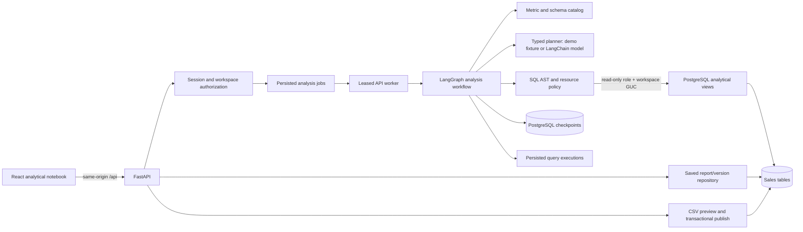
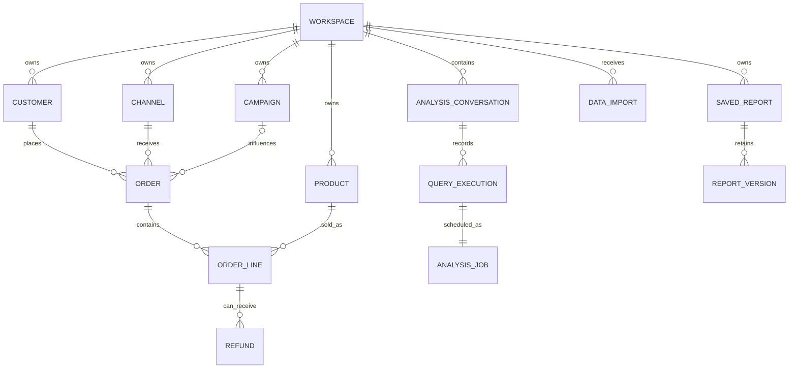

# Architecture

DataTalk is a modular monolith with one PostgreSQL database and two roles at runtime. The app role manages conversations, imports, and report versions. The analytical role can select only scoped analytical views and defaults to read-only transactions. Each installation is intended for one customer, while two seeded workspaces test isolation.

## Analysis boundary

Natural language never becomes an unrestricted database operation. The planner produces a typed metric/dimension/date/filter request. Compilation uses known views and columns. The SQL parser checks the AST, identifiers, functions, statement count, limit, and complexity. Execution sets a workspace-specific PostgreSQL transaction setting, read-only transaction, statement timeout, and row cap. The database role has no write grants or direct base-table read grants. Application validation and database privileges are independent checks.

The answer derives numeric claims from result rows, not generated prose. Report versions retain the question, plan, SQL, result, chart, snapshot/hash, and model/prompt versions. Conversation metadata is stored independently of result rows. See [SECURITY.md](SECURITY.md) for trust boundaries and [OPERATIONS.md](OPERATIONS.md) for recovery and backup.

## Decision records

- [0001 — Modular monolith](adr/0001-modular-monolith.md)
- [0002 — Typed plan and bounded SQL](adr/0002-typed-plan-and-sql-policy.md)
- [0003 — Synthetic fast/full profiles](adr/0003-synthetic-profiles.md)
- [0004 — Versioned report evidence](adr/0004-versioned-reports.md)
